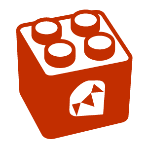

# MRuby Devkit



MRuby Devkit 是一个开箱即用的脚手架。 基于 MRuby 将你的 Ruby 代码打包成 二进制可执行文件。

方便开发类似于 Golang 的二进制可执行文件。

> —— 灵感来自于 Golang 可以编译为二进制可执行文件的迷人特性。


# 一、使用约定

## 前置运行环境

MacOS、Linux

* GCC/Clang
* Make
* Git
* Ruby3
  * Rake 安装 `gem install rake`


## 约定

### 1. `src/main.rb` 程序入口

程序入口不可修改。它是 `run`、`build` 寻找的入口。

### 2. `src/lib/*.rb` 是多文件

lib 中适合存放拆分的多文件。

多文件中，如果存在依赖关系。需要特殊命名比如 01xxx， 02xxx …… 控制相对顺序。

多文件最终会被拼接成一个上下文送入编译。

### 3. `mruby.conf.rb` 是 mgem 配置文文件

可以引入 [第三方 mgem ](https://mruby.org/libraries/)

裁剪需要加入的 gem，控制编译选项。

#### 注意：
* 第三方标准库并不是每一个都可以被正确 build 比如 mgem-curses 无法 build，因为存在 BUG。
* 要正确的配置编译选项，确保 mruby 产生。
* 配置的 mgem 可以直接在上下文中使用，不需要 require

## 差异

* MRuby 和 CRuby 标准库有差异，请关注官方的文档
* 工作模式是：裁剪 mgem 、功能，最后编译的解释器 + mruby 代码 进行联合工作。 mruby 代码不需要 require 语句导入包。
* MRuby 有可能工作在嵌入式环境中，以及可能没有文件系统的硬件中。所以编译成 二进制应用。
* MRuby 和 CRuby 内核不同。 MRuby 实现精简高效，全部采用可跨平台的 C 语言，内存实现高效，精简，适用于嵌入式、跨平台。
* MRuby 更像是 C 项目在开发，需要了解 C 语言以及构建的概念

---

# 二、开发

## 0. 编写程序

`src` 下编写 ruby 程序

## 1. 运行程序

> 模仿 golang 的 go run

`rake run`

## 2. 编译当前程序（默认使用当前计算机平台）

> 模仿 golang 的 go build

`rake build`

## 3.交叉编译的包

借助 Github Action 编译不同平台的可执行二进制文件。

* 可以 fork 仓库在  Github Action 运行结果下可以看到构建产物。

Github Action 提供免费的 Runner
* Windows
* MacOS AMD64
* MacOS ARM64
* Ubuntu AMD64

如果你想获得 Linux aarch64 需要自建 Runner
所以你需要修改 [.github/workflows/raspbian-aarch64.yml](https://github.com/Mark24Code/mruby-devkit/blob/main/.github/workflows/raspbian-aarch64.yml) 使用自己的支持 aarch64 的runner。


## 4. 内置 Rake 命令

rake -T 查看可用命令

```
➜  build git:(main) rake -T
rake build               # build program
rake build_merge         # merge program in build
rake build_to_c          # build to c code
rake cache_merge         # merge program in cache
rake clean               # clean
rake init_build          # init build dir
rake init_cache          # init develop cache dir
rake mruby:build         # build mruby
rake mruby:build_config  # replace mruby build config
rake mruby:custom_build  # custom config build mruby
rake mruby:download      # download mruby
rake mruby:init          # init
rake run                 # run program
```


----

# TODO

- [x] 交叉编译
- [x] 多文件
- [x] run 命令 
- [x] build 命令 
- [x] 自动初始化

---

# 平台：

MacOS

- AMD64 ✅
- ARM64 ✅

Debian/Ubuntu/Mint Linux

- AMD64 ✅
- ARM64 ✅

